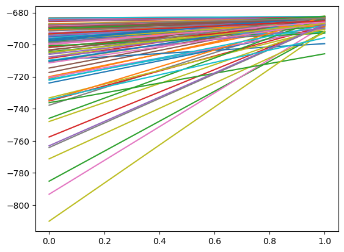
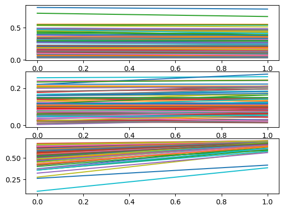
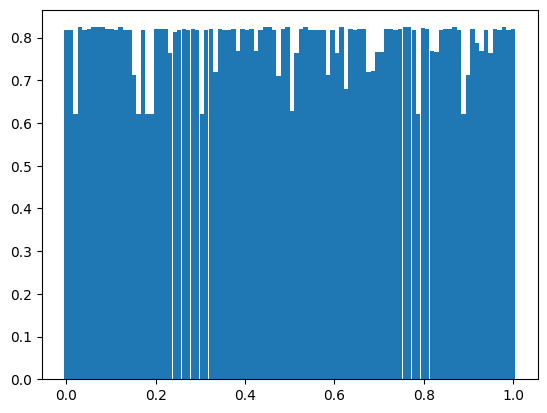
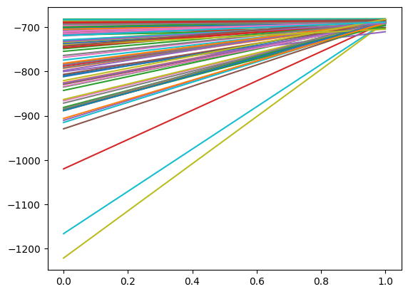
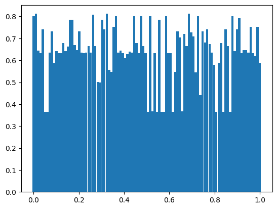

### The Baum-Welch algorithm for the weather-system HMM

Given a hidden Markov-chain (HMM), consisting of a set of states (which are hidden) and observations, the goal is to estimate the parameters of the system. Here, the parameter set consists of the transition matrix $A$, the emission matrix $B$ and the initial starting probabilities $\pi$. If $N$ is the amount of states, $M$ the amount of possible observations in each timestamp and $T$ the amount of timestamps of the system (discrete integers), then $A$ is a $N\times N$ matrix where $a_{i,j}=\mathbb{P}(S_{t+1}=j\ |\ S_t=i\text{ for all }t)$ (being the probability that the next state $S_{t+1}$ will be $j$ given the current state $i$), $B$ is a $N\times M$ matrix where $b_{i,k}=b_i(O_t)=\mathbb{P}(O_t=k\ |\ S_t=i\text{ for all }t)$ (being the probability that we observe $O_t$ to be k given that we are in state $i$) and $\pi$ is a vector of length $N$ where $\pi_i=\mathbb{P}(S_1=i)$ (being the probability that the HMM started in state $i$).

The first step in the algorithm is making a guess for the values of $A$, $B$ and $\pi$ to initialize them.

#### Expectation Step

The second step is called the expectation-step, where we estimate the probability that the observations that we saw came from the parameters $\theta=(A,B,\pi)$ that we currently have.

This step consists of the so-called forward and backward algorithm.

##### Forward algorithm

In the forward algorithm, we estimate the probability that the observed sequence of the HMM from $t=1$ to $t=t$, ended in state $i$, we denote this by $\alpha_t(i)=\mathbb{P}(O_1,...,O_t,S_t=i)$. For this, we first initialize $\alpha_1(i)=\pi_i b_i(O_1)$, (the probability that we were in state $i$ at the beginning times the probability that the first observation ($O_1$) occured during state $i$). Then, we compute  
$\alpha_t(j)=b_j(O_t)\sum_i\alpha_{t-1}(i)a_{i,j}$  
recursively. So we consider all ways to reach state $j$ from previous states $\alpha_{t-1}(i)a_{i,j}$ multiplied by the probability of seeing observation $O_t$ in state $j$.

##### Backward algorithm

In the backward algorithm, we do the opposite: we estimate the probability of observing the future from $t=t+1$ onward, given state $i$ at time $t$. We denote this by $\beta_t(i)=\mathbb{P}(O_{t+1},...,O_T\ |\ S_t=i)$. We initialize $\beta_T(i)=1$ (since there is no future at $t=T$), and then we compute recursively again:  
$\beta_t(i)=\sum_j a_{i,j}b_j(O_{t+1})\beta_{t+1}(j)$  
So here we are considering the sum over all possible future states $j$ (the sum of the product of the probability of moving from state $i$ to $j$ times the probability of observing $O_{t+1}$ during state $j$ times the probability of having gotten to the next state $S_{t+1}$).

Next, we compute $\gamma\in\mathbb{R}^{T\times N}$ where $\gamma_t(i)=\mathbb{P}(S_t=i\ |\ O_1,...,O_T)$ (the probability that we were in state $i$ at time $t$ given the observations), by  
$\gamma_t(i)=\frac{\alpha_t(i)\beta_t(i)}{\sum_j\alpha_t(j)\beta_t(j)}$  
The way we get this formula, is by transforming the formula for gamma: $\gamma_t(i)=\mathbb{P}(S_t=i\ |\ O_1,...,O_T)=\mathbb{P}(S_t=i,O_1,...,O_T)/\mathbb{P}(O_1,...,O_T)$ and splitting $O_1,...,O_T$ into $O_1,...,O_t$ and $O_{t+1},...,O_T$ for each $t$, and because $\mathbb{P}(S_t=i,O_1,...,O_t)=\alpha_t(i)$ and $\mathbb{P}(S_t=i,O_{t+1},...,O_T)=\beta_t(i)$ we get the formula for the numerator. The formula for the denominator follows from the fact that $\mathbb{P}(O_1,...,O_T)$ is just the sum over all states $j$ of $\alpha_t(j)\beta_t(j)$ (we are considering the probability of having seen the given observations, no matter the end state).

Then we compute $\xi\in\mathbb{R}^{T\times N\times N}$ where $\xi_t(i,j)=\mathbb{P}(S_t=i,S_{t+1}=j\ |\ O_1,...,O_T)$ (the probability that we were in state $i$ at time $t$ and that the next state $S_{t+1}$ will be $j$, given the observations), by  
$\xi_t(i,j)=\frac{\alpha_t(i)a_{i,j}b_j(O_{t+1})\beta_{t+1}(j)}{\sum_{k,l}\alpha_t(k)a_{k,l}b_l(O_{t+1})\beta_{t+1}(l)}$  
We obtain this equation by further developing the formula for xi: $\xi_t(i,j)=\mathbb{P}(S_t=i,S_{t+1}=j\ |\ O_1,...,O_T)=\mathbb{P}(S_t=i,S_{t+1}=j,O_1,...,O_T)/\mathbb{P}(O_1,...,O_T)$  
In the numerator, $\mathbb{P}(S_t=i,S_{t+1}=j,O_1,...,O_T)=\alpha_t(i)a_{i,j}b_j(O_{t+1})\beta_{t+1}(j)$, we count the probability of having gotten to state $i$ at time $t$ whilst having transitioned into the next state $j$, whilst also having observed state $j$ at time $t+1$, multiplied by the probability of observing $O_{t+1},...,O_T$ in the future (being $\beta_{t+1}(j)$). In the denominator, we simply compute the same but summing over all possible states $k,l$, accounting for the probability of having seen the observations no matter the (next) state of time $t$.

#### Maximization Step

In the third step, the maximization step, we update the parameters $\theta=(A,B,\pi)$ using the estimated probabilities from the previous step.  
We compute the values for $A$ by:  
$a_{i,j}=\frac{\sum_{t}^{T-1}\xi_t(i,j)}{\sum_{t}^{T-1}\gamma_t(i)}$  
So this is the ratio between every time we were in state $i$ AND when the next state was $j$, to every time we were in state $i$.  
We then compute the values for $B$ by:  
$b_{i,k}=\frac{\sum_{t}^T\gamma_t(i)(1\text{ if }O_t=k\text{ else }0)}{\sum_{t}^T\gamma_t(i)}$  
So this is the ratio between every time we were in state $i$ AND when we observed observation $k$ at time $t$, to every time we were in state $i$.

We then repeat this procedure by going back to step 2. The algorithm will converge to a local extremum, but not necessarily the global optimum.  
We can also compute the log-likelyhood of the system: $\text{log}\sum_i\alpha_T(i)$. This will give a measure of certainty of the estimation of the parameters. This represents the log of the fraction of observation data that gets explained by the estimated parameters. The algorithm will converge to a certain value of this log-likelyhood and we detect how much this changes during every iteration step.  
My implementation for the weather HMM will run the algorithm multiple times and then store every log-likelyhood and parameter instance estimated, and then compare.

#### Evaluating the model

After every time we run the training, meaning we exit if the desired error tolerance is reached or if too many attempts have been used, we first have to "align" the predicted parameters $A$, $B$ and $pi$ in the right direction.  
The reason we have to do this is because when the model constructs the parameters, it predicts the values for $A$, $B$ and $pi$ up to a permutation only. Applying a different permutation to $A$, $B$ and $pi$ gives the same likelyhood of the data.  
We therefor use the Hungarian method to find a best-fit assignment between the real values of the parameters and the estimated parameters, which corresponds to finding a correct permutation for the parameters.

https://en.wikipedia.org/wiki/Hungarian_algorithm

After having done this, I test the model on "future" data (not really future, since it's all synthetic), in two different ways.

##### Viterbi algorithm

I first assume the model has access to the future observation sequence, and I will test the model on its ability to generalize on estimating the underlying state sequence.

https://en.wikipedia.org/wiki/Viterbi_algorithm

For this, I store two structures $\delta,\psi\in\mathbb{R}^{T\times N}$, where $\delta_t(i)$ represents the maximum probability, over all possible state sequences, of seeing these states under the respected observation states, where the state at time $t-1$ ends in $i$, given the estimated parameters. So    
$\delta_t(i)=\underset{S_0,...,S_{t-1}}\max\mathbb{P}(S_0,S_1,...,S_{t-1}=i,O_1,...,O_T\ |\ \theta)$  
I initialize $\delta_1(i)=\pi_ib_i(O_1)$ and then run over all future timestamps $t=T+1$ until $t=T_{\text{tend}}$, where I calculate dynamically:  
$\delta_t(i)=\underset{j}\max(\delta_{t-1}(j)a_{i,j})b_i(O_t)$  
So we compute the maximum probability of the previous timestamp multiplied by the transition probability, multiplied by the probability that we observed $O_t$.  
We also store  
$\psi_t(i) = \underset{j}{\mathrm{argmax}}\ \delta_{t-1}(j)a_{i,j}$  
which is the state $j$, which given that the maximum probability path ended in state $i$, is the most likely to have preceded state $i$ at time $t-1$.  
Next, we initialize the predicted state sequence by setting  
$S_{T_{\text{end}}}=\underset{j}{\mathrm{argmax}}\ \delta_{T_{\text{end}}}(j)$  
and then iterate backwards:  
$S_t=\psi_{t+1}(S_{t+1})$

##### Predictions when future observations are unknown

We also wish to evaluate the model on future data, assuming the current timestamp is $t=T$ and we don't have knowledge of the future observations, like we did with the Viterbi algorithm.  
For evaluating this, we will compute two arrays, namely the predicted state- and observation sequence.  
We will iterate over all future timestamps, from $t=T$ to $t=T_{\text{end}}$, and compute the predicted states and observations from the previous values (dynamic programming). We denote

$\bar{S}_{t}$

for the predicted state at time $t$ and

$\bar{O}_{t}$

for the predicted observation at time $t$.  
We initialize:

$\bar{S}_{T+1}=\underset{j}{\mathrm{argmax}}\ \gamma_T(j)$

so we take the most probable state $j$ occuring at time $T$. We also initialize the observation sequence as:

$\bar{O}_T=\underset{j}{\mathrm{argmax}}\ b_T(j)$.

Here we take the most probable observation occuring under the current estimation of $b$, given the predicted state of time $T+1$.    
We can then compute the next elements in respectively the state and observation sequence dynamically as

$\bar{S}_{t}=\underset{j}{\mathrm{argmax}}\ (S_tA_j)$

$\bar{O}_{t}=\underset{j}{\mathrm{argmax}}\ b_t(j)$

Here, the normalized vector (sum should equal 1) of $\S_tA$ is essentially the probability distribution of the next state (we multiply by the transition probability matrix $A$) and we simply take the most probable state $j$, for the value $S_t$, and $b_{S_t}(j)$ is the probability of emitting observation $j$ given that we were in state $S$ at time $t$. We also take the most probable observation here, for obtaining $O_t.

We can then simply count the fraction of correctly predicted states and observations by comparing the predictions to the actual "true" values.

### The weather HMM, but with continuous observation distribution

In the file "weather_hmm_continuous.ipynb" I have reconstructed the weather HMM from the previous implementation, but with a more interesting approach. I have extended the set of possible states from {rain, no rain} to {rain and warm, rain and cold, dry and warm, dry and cold}, but most importantly made the observation space a continuous length-2 vector (temperature, rain_intensity).

A few interesting things change in the implementation.

Now, instead of $B$ being a static $N\times M$ matrix where $B_{i,k}=\mathbb{P}(\text{emitted observation }k\text{ in state }i)$ (where $N$ is the amount of states and $M$ the amount of observable states), now B is a $T\times M$ matrix where $B_{t,k}=b_t(k)=\mathbb{P}(O_t=o_k\ |\ S_t=k)$. Here, $O_t$ is a stochastic variable following a multivariable Gaussian distribution, with mean $\mu_i$ being the mean observation vector of state $i$ (two components here) and covariance matrix $\Sigma_i$ encoding the interdependence and relative variance between the labels "temperature" and "rain intensity" of state $i$. So we can calculate $b_t(k)$ by computing the PDF function of the multivariate Gaussian distribution with parameters $\mu_i$ and $\Sigma_i$. However, since we are working with logarithms, we will be computing the log of this value.

#### Evaluation

For the evaluation step, a few things change as well.  
Instead of computing the permutation indices (by using the Hungarian method again) by using $B$, now we cannot do this anymore, because $B$ isn't a static $M\times N$ matrix anymore. We instead obtain the permutation indeces by matching using the true and estimated values of $\mu$ and $\Sigma$.

For this, we use a measure of statistical difference called the KL-divergence.

https://en.wikipedia.org/wiki/Kullback%E2%80%93Leibler_divergence

We will compute the "difference" between $\Sigma_{\text{estimated}}$ and $\Sigma_{\text{real}}$ using this method, but because this function is not symmetric, we will compute

$D_{\text{sym}}(P,Q)=D_{KL}(P\ |\ Q)+D_{KL}(Q\ |\ P)$

with $P=\Sigma_{\text{estimated}}$ and $Q=\Sigma_{\text{real}}$, as the measure we will use for permuting the matrices.  
For the multivariate normal distribution, there exists a close form of this formula:

$D_{KL}(\mathcal{N}(\mu_1,\Sigma_1)\ |\ \mathcal{N}(\mu_2,\Sigma_2))=\frac{1}{2}(\text{Tr}(\Sigma_{2}^{-1}\Sigma_{1})+(\mu_2-\mu_1)^T\Sigma_{2}^{-1}(\mu_2-\mu_1)-d+\text{log}(\text{det}\Sigma_2/\text{det}\Sigma_1))$

with $d$ being the dimensionality of the data (2 in this case).  
We can then construct a distance matrix $C\in\mathbb{R}^{M\times M}$ where

$C_{i,j}=D_{\text{sym}}(\Sigma_{i}^{\text{estimated}}\ |\ \Sigma_{i}^{\text{real}})$

and then use the Hungarian algorithm on this cost matrix.

##### Viterbi

Not much changes here, except for the fact that we have to modify the calculation for $\delta$ a bit, since the structure of $B$ is different now.

##### Predictions when future observations are unknown

For this step, the only thing that changes here is the fact that now we use the argmax of the mean temperature and rain values for each state, instead of deriving it using $B$. We also have, of course, that the predicted observation structure is now a $T\times 2$ matrix (rows for temperature and rain):

$\bar{O}_{T,m}=\underset{j}\mathrm{argmax}\ \mu_{j,m}$

We then compute the predicted observation at time $t$ and feature $m$ (here we have $m\in\{0,1\}$):

$\bar{O}_{t,m}=\pi\mu_{:,m}$

where $\mu_{:,m}$ is the m-th column of $\mu$.

### Experimenting with initial parameter guesses

For both of the intstances of the weather HMM, I wanted to experiment how far or close the estimated parameters come during the training to the actual parameters.

To research this, I experimented with the initial parameter distribution for $A$, $B$, and $pi$ by modifying their generation algorithms.

I started out by simply adding noise to the true values and making sure all probabilities where in the bounds of 0.01 and 0.9:

```
A_first_col = np.clip(A_real_first_col + np.random.normal(0, 0.2, 2), a_min=0.01, a_max=0.9)
A = np.empty((2, 2))
A[:, 0] = A_first_col
A[:, 1] = 1 - A_first_col

B_first_col = np.clip(B_real_first_col + np.random.normal(0, 0.05, 2), a_min=0.01, a_max=0.9)
B = np.empty((2, 2))
B[:, 0] = B_first_col
B[:, 1] = 1 - B_first_col

p = np.clip(pi_real[0] + np.random.normal(0, 0.05), a_min=0.01, a_max=0.9)
pi = np.array([p, 1 - p])
```

This, expectedly so, worked very well. If we look at the convergence of the log-likelyhood:



The error distribution of the parameter guesses looks like:



And the distribution of the fraction of correct state guesses when having used the viterbi algorithm:



The best and worst fraction of correct guesses looks like

```
maximum pct correct: 0.8240000000000001 from attempt 4
minimum pct correct: 0.62 from attempt 3
```

I then experimented by using a uniform distribution to make the initial guesses, instead of having to rely on the true parameters.

```
A_first_col = np.random.uniform(0.3, 0.7, 2)
A = np.empty((2, 2))
A[:, 0] = A_first_col
A[:, 1] = 1 - A_first_col

B_first_col = np.random.uniform(0.3, 0.7, 2)
B = np.empty((2, 2))
B[:, 0] = B_first_col
B[:, 1] = 1 - B_first_col

p = np.random.uniform(0.3, 0.7)
pi = np.array([p, 1 - p])
```

This method of parameter initialization is clearly more realistic. If we look at the log-likelyhood distribution in this case, we can see:



And the error of the paremeter estimations:


And the distribution of the fraction of correct state guesses when having used the viterbi algorithm:



The best and worst fraction of correct guesses looks like

```
maximum pct correct: 0.812 from attempt 2
minimum pct correct: 0.366 from attempt 6
```

What is interesting is that using both methods, we can see that pretty much all log-likelyhood values converge to about the same value. However, the error term in the parameter estimations (second plot) is larger in the second attempt, which makes intuitive sense. We can also see the distribution of the fraction of correct state estimations varies more in the second attempt, which again makes sense because we are spreading our guesses more.